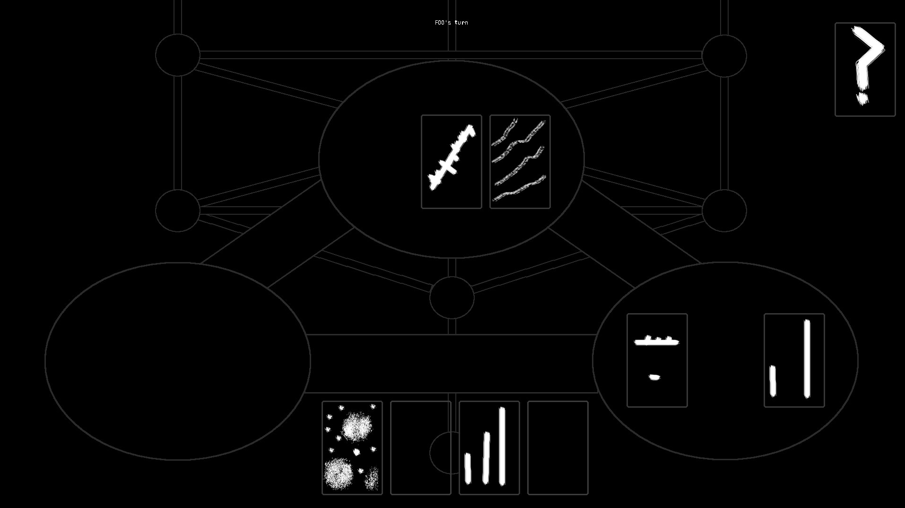
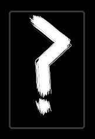
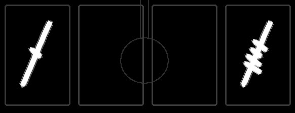
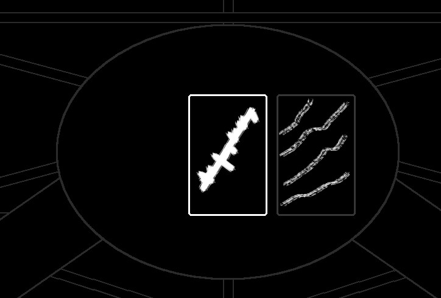
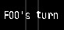

# ALTAR 10-9-21

## About
Altar is a musical piece for 1+ laptop performers.
Inspired by card games, indie video games, and electronic music.  Built with Pygame and PYO.
Performers take turns moving cards around a game board that reacts musically to these actions. 
## Easy Setup
Pre-compiled executables can be found in the releases sidebar for both Windows and OSX

## Running from source
Requires python 3.6-3.8

The latest version of python can be installed here:
https://www.python.org/downloads/


Next, download the code hosted at this Github repo.

If you have git installed at the command line, you can use:

```
git clone https://github.com/trian-gles/altar_2021
```
OR

Use this button on the top right of this github page:


Once the code is downloaded, from the root altar directory install the required python packages:

```
pip install -r requirements.txt
```

Finally, run the main script:
```
python main.py
```

For additionally command line options, use `-h`

## Single Player Launch
Altar can be performed/practiced in a single player mode, or in a multiplayer mode with any number of performers.
For single player select this option in the start menu and the piece will begin.

## Multiplayer Launch

For multiplayer mode, all performers must be connected via LAN.
A machine should host the server by running:
```
python lan_server.py
```

Note - this machine can also be used as a performer by separately running the main.py script.

In this mode, one performer should be designated as the ADMIN by selecting the "admin" option.  This player will be
given special START and QUIT controls to start the piece after all performers have joined, and to end the program for all
performers.

Performers can chose whether they want their machine to run the audio engine by adding the
selecting the "audio" option.
In a performance with all performers in the same location, one performer should hook up their machine to speakers and 
use the "audio" option, while all others can leave this out.

The optional "username" field can inform other players of each other's names during turn rotations.
If this is left out, the performer will be provided with a username of a random string of digits.

A machine can be used to run a projector for the audience to view by checking the "Projector view" option.
This view cannot move cards, and shows no draw/discard piles or hand.
Again, this machine can separately run an instance of the piece for a performer to use.

## Inside the game
On their turn players can click on any card to move it elsewhere.
Shown here is the full board:



The draw pile. Click on a card to pick it up and move it to your hand or a musical zone:



Your hand, of cards only you can see or use.  Putting cards here will not affect the audio engine.
Click one to pick it up and move it elsewhere: 



One of three musical zones.  Dropping cards in here will modify its sound.  
Alternatively, you can right click a card on your turn to reactivate its effects.  
A zone with no cards will (usually) stop 
playing.




The discard area.  Putting a card here deletes it.  Cards can also be deleted by dropping them on top of each other.


Text appearing only in multiplayer mode annoucing whose turn is up.  The suggested turn order is not enforced, and if
players feel they have better ideas



The piece ends when the draw pile is empty, and all cards have been removed from the boards.  
Not all cards need to be played, and players can leave cards in their hands at the end of the piece.

## Future updates:
- More cards
- More mysteries

## !!SPOILERS!!
## !!SPOILERS!!
## !!SPOILERS!!
## !!SPOILERS!!
- Don't worry if you're not sure what's going on.  That's my intent
- Not all zones have to be active simultaneously. 
- Sometimes the engine will make noise with completely empty zones!
- Colored cards affect all zones
- Some cards will only have their effects the moment they are dropped in a new zone.  Others will continue to effect whatever zone they 
are dropped in.
- Repeatedly reapplying(right clicking) certain cards can have crazy results
